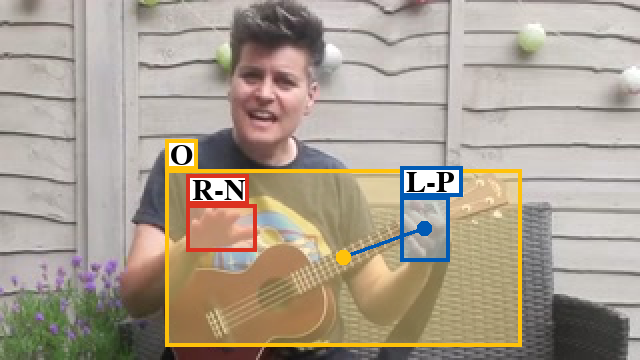

## Introduction

This repo is based on Faster-RCNN.

Running the repo in Colab is recommended, copy the file [HOI detection.ipynb](https://colab.research.google.com/drive/1AEAgVhDKNsmUmmDRG9dP9y4VToC4pVn1?usp=sharing), then run it on Colab. (remember to change the runtime type to GPU in Colab)


## 【1】Prerequisites (Colab user can skip this step) 

* Python 3.7
* Pytorch 1.6
* CUDA 10.1

Create a new conda called handobj, install pytorch-1.6.0
```
conda create --name handobj python=3.7
conda activate handobj

# for cpu
conda install pytorch==1.6.0 torchvision==0.7.0 cpuonly -c pytorch  

# for GPU
conda install pytorch==1.6.0 torchvision==0.7.0 cudatoolkit=10.1 -c pytorch
```


## 【2】Installation & Compile

Clone the code
```
git clone https://github.com/forever208/Hand-Object-Interaction-detection.git
```

Install all the python dependencies using pip:
```
pip install -r requirements.txt
```

Compile the cuda dependencies using following simple commands:
```
cd lib
python setup.py build develop
cd ..
```

Install coco_python_API
```
mkdir data
cd data
git clone https://github.com/pdollar/coco.git 
cd coco/PythonAPI
make
cd ../../..
```


## 【3】Run Demo

### Download the model
Creat a folder `./models/res101_handobj_100K/pascal_voc`, then download the model.
```
mkdir -p ./models/res101_handobj_100K/pascal_voc
cd models/res101_handobj_100K/pascal_voc
wget --load-cookies /tmp/cookies.txt "https://docs.google.com/uc?export=download&confirm=$(wget --quiet --save-cookies /tmp/cookies.txt --keep-session-cookies --no-check-certificate 'https://docs.google.com/uc?export=download&id=166IM6CXA32f9L6V7-EMd9m8gin6TFpim' -O- | sed -rn 's/.*confirm=([0-9A-Za-z_]+).*/\1\n/p')&id=166IM6CXA32f9L6V7-EMd9m8gin6TFpim" -O faster_rcnn_1_8_89999.pth && rm -rf /tmp/cookies.txt
cd ../../..
```

the folder structure looks like this:
```
models
└── res101_handobj_100K
    └── pascal_voc
        └── faster_rcnn_{checksession}_{checkepoch}_{checkpoint}.pth
```

### run demo

Put your images in the `images/` folder and run the command. 
```
python demo.py --checkepoch=8 --checkpoint=89999
```

A new folder `images_det/` will be created with the detected results


**Params to save detected results** in demo.py you may need for your task:
* hand_dets: detected results for hands, [boxes(4), score(1), state(1), offset_vector(3), left/right(1)]
* obj_dets: detected results for object, [boxes(4), score(1), <em>state(1), offset_vector(3), left/right(1)</em>]

We did **not** train the contact_state, offset_vector and hand_side part for objects. We keep them just to make the data format consistent. So, only use the bbox and confidence score infomation for objects.  

**Matching**:

Check the additional [matching.py](https://github.com/ddshan/Hand_Object_Detector/blob/master/lib/model/utils/matching.py) script to match the detection results, **hand_dets** and **obj_dets**, if needed.  


### One Image Demo Output:

Color definitions:
* yellow: object bbox
* red: right hand bbox
* blue: left hand bbox

Label definitions:
* L: left hand
* R: right hand
* N: no contact
* S: self contact
* O: other person contact
* P: portable object contact
* F: stationary object contact (e.g.furniture)




## 【4】Train

### Download dataset
creat a folder `./data`, then download the dataset and unzip it.
```
mkdir data
cd data

wget https://fouheylab.eecs.umich.edu/~dandans/projects/100DOH/downloads/pascal_voc_format.zip
unzip pascal_voc_format.zip
rm -rf pascal_voc_format.zip

cd ..
mv data/pascal_voc_format/VOCdevkit2007_handobj_100K/ data/
```

### Download pre-trained Resnet-101 model
Download pretrained Resnet-101 model by running the command
```
cd data
mkdir pretrained_model
cd pretrained_model

wget --load-cookies /tmp/cookies.txt "https://docs.google.com/uc?export=download&confirm=$(wget --quiet --save-cookies /tmp/cookies.txt --keep-session-cookies --no-check-certificate 'https://docs.google.com/uc?export=download&id=1Pyv546ss5q4idvcXE_Z_GFn_qOhDz10H' -O- | sed -rn 's/.*confirm=([0-9A-Za-z_]+).*/\1\n/p')&id=1Pyv546ss5q4idvcXE_Z_GFn_qOhDz10H" -O resnet101_caffe.pth && rm -rf /tmp/cookies.txt
```

So far, the data/ folder should be like this:
```
data/
├── pretrained_model
│   └── resnet101_caffe.pth
├── VOCdevkit2007_handobj_100K
│   └── VOC2007
│       ├── Annotations
│       │   └── *.xml
│       ├── ImageSets
│       │   └── Main
│       │       └── *.txt
│       └── JPEGImages
│           └── *.jpg
```

To train a hand object detector model with resnet101 on pascal_voc format data, run:
```
python trainval_net.py --model_name handobj_100K --log_name=handobj_100K --dataset pascal_voc --net res101 --bs 1 --nw 2 --lr 1e-3 --lr_decay_step 3 --cuda --epoch=10 --use_tfb 
```


## 【5】Test
To evaluate the detection performance, run:
```
python test_net_Colab.py --model_name=handobj_100k --save_name=handobj_100k --cuda --checkepoch=8 --checkpoint=89999
```


## 【6】Benchmarking (AP)
<!-- Table, test on all -->
- Tested on the testset of our **100K and ego** dataset:
<table><tbody>
<tr>
<td align="center">Name</td>
<td align="center">Hand</td>
<td align="center">Obj</td>
<td align="center">H+Side</td>
<td align="center">H+State</td>
<td align="center">H+O</td>
<td align="center">All</td>
<td align="center">Model Download Link</td>
</tr>

<tr>
<td align='left'>handobj_100K+ego</td>
<td align='center'>90.4</td>
<td align='center'>66.3</td>
<td align='center'>88.4</td>
<td align='center'>73.2</td>
<td align='center'>47.6</td>
<td align='center'>39.8</td>
<td align="center"><a href="https://drive.google.com/open?id=1H2tWsZkS7tDF8q1-jdjx6V9XrK25EDbE">faster_rcnn_1_8_132028.pth</a></td>
</tr>

<tr>
<td align='left'>handobj_100K</td>
<td align='center'>89.8</td>
<td align='center'>51.5</td>
<td align='center'>65.8</td>
<td align='center'>62.4</td>
<td align='center'>27.9</td>
<td align='center'>20.9</td>
<td align="center"><a href="https://drive.google.com/open?id=166IM6CXA32f9L6V7-EMd9m8gin6TFpim">faster_rcnn_1_8_89999.pth</a></td>
</tr>

</tbody></table>


<!-- Table, test on 100K -->
- Tested on the testset of our **100K** dataset:
<table><tbody>
<tr>
<tr><td align="center">Name</td>
<td align="center">Hand</td>
<td align="center">Obj</td>
<td align="center">H+Side</td>
<td align="center">H+State</td>
<td align="center">H+O</td>
<td align="center">All</td>
</tr>

<tr>
<td align='left'>handobj_100K+ego</td>
<td align='center'>89.6</td>
<td align='center'>64.7</td>
<td align='center'>79.0</td>
<td align='center'>63.8</td>
<td align='center'>45.1</td>
<td align='center'>36.8</td>
</tr>

<tr>
<td align='left'>handobj_100K</td>
<td align='center'>89.6</td>
<td align='center'>64.0</td>
<td align='center'>78.9</td>
<td align='center'>64.2</td>
<td align='center'>46.9</td>
<td align='center'>38.6</td>
</tr>

</tbody></table>


<!-- Table, test on ego -->
- Tested on the testset of our **ego** dataset:
<table><tbody>
<tr>
<tr><td align="center">Name</td>
<td align="center">Hand</td>
<td align="center">Obj</td>
<td align="center">H+Side</td>
<td align="center">H+State</td>
<td align="center">H+O</td>
<td align="center">All</td>
</tr>

<tr>
<td align='left'>handobj_100K+ego</td>
<td align='center'>90.5</td>
<td align='center'>67.2</td>
<td align='center'>90.0</td>
<td align='center'>75.0</td>
<td align='center'>47.4</td>
<td align='center'>46.3</td>
</tr>

<tr>
<td align='left'>handobj_100K</td>
<td align='center'>89.8</td>
<td align='center'>41.7</td>
<td align='center'>59.5</td>
<td align='center'>62.8</td>
<td align='center'>20.3</td>
<td align='center'>12.7</td>
</tr>

</tbody></table>


The model **handobj_100K** is trained on trainset of **100K** youtube frames. 

The model **handobj_100K+ego** is trained on trainset of **100K** plus additional **egocentric** data we annotated, which works much better on egocentric data. 

We provide the frame names of the egocentric data we used here: [trainval.txt](https://github.com/ddshan/hand_object_detector/blob/master/assets/data_ego_framename/trainval.txt), [test.txt](https://github.com/ddshan/hand_object_detector/blob/master/assets/data_ego_framename/test.txt). This split is backwards compatible with
the [Epic-Kitchens2018](https://epic-kitchens.github.io/2018) (EK), [EGTEA](http://cbs.ic.gatech.edu/fpv/), and [CharadesEgo](https://prior.allenai.org/projects/charades-ego) (CE).


## Citation

If this work is helpful in your research, please cite:
```
@INPROCEEDINGS{Shan20, 
    author = {Shan, Dandan and Geng, Jiaqi and Shu, Michelle  and Fouhey, David},
    title = {Understanding Human Hands in Contact at Internet Scale},
    booktitle = CVPR, 
    year = {2020} 
}
```
When you use the model trained on our ego data, make sure to also cite the original datasets ([Epic-Kitchens](https://epic-kitchens.github.io/2018), [EGTEA](http://cbs.ic.gatech.edu/fpv/) and [CharadesEgo](https://prior.allenai.org/projects/charades-ego)) that we collect from and agree to the original conditions for using that data.
